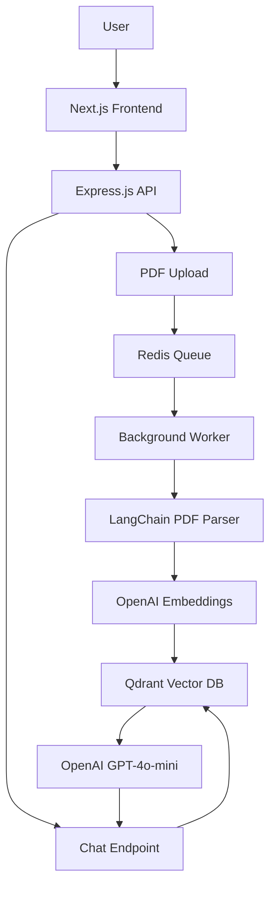

# 🤖 Chat with PDF

<div align="center">


**Upload PDFs and chat with them using AI!** 🚀

A full-stack application that allows you to upload PDF files and have intelligent conversations about their content using OpenAI's GPT models.

[](http://localhost:3000)
[](http://localhost:8000)

</div>

## ✨ Features

- 📄 **PDF Upload**: Drag-and-drop interface for easy file uploads
- 🔄 **Real-time Processing**: Background processing with progress indicators
- 💬 **AI Chat**: Intelligent conversations about your PDF content
- 📚 **Source References**: See exactly which parts of your PDF were used
- 🎨 **Modern UI**: Beautiful, responsive interface built with Tailwind CSS
- 🐳 **Docker Support**: Easy deployment with Docker Compose
- ⚡ **Fast & Scalable**: Built with Next.js 15 and Express.js

## 🏗️ Architecture



## 🚀 Quick Start

### Prerequisites

- **Node.js** 18+ 
- **Docker** and **Docker Compose**
- **OpenAI API Key** ([Get one here](https://platform.openai.com/account/api-keys))

### 1. Clone the Repository

```bash
git clone https://github.com/nikk2511/chat-to-pdf.git
cd chat-to-pdf
```

### 2. Set Up Environment Variables

```bash
# Copy the example environment file
cp server/config.env server/.env

# Edit server/.env and add your OpenAI API key
OPENAI_API_KEY=your_openai_api_key_here
```

### 3. Start with Docker (Recommended)

```bash
# Start all services
docker-compose up -d

# View logs
docker-compose logs -f
```

### 4. Manual Setup (Alternative)

```bash
# Start infrastructure services
docker-compose up -d valkey qdrant

# Install and start server
cd server
npm install
npm run dev

# In another terminal, start the worker
npm run dev:worker

# Install and start client
cd ../client
npm install
npm run dev
```

### 5. Access the Application

- **Frontend**: http://localhost:3000
- **Backend API**: http://localhost:8000
- **Qdrant Dashboard**: http://localhost:6333/dashboard

## 📖 Usage

1. **Upload a PDF**: Click the upload area and select a PDF file
2. **Wait for Processing**: The file will be processed and indexed (may take a few moments)
3. **Start Chatting**: Ask questions about the content of your PDF
4. **View Sources**: Click "View sources" to see which parts of the PDF were used

### Example Questions

- "What is this document about?"
- "Summarize the main points"
- "What are the key findings?"
- "Explain the methodology used"

## 🔧 API Endpoints

| Method | Endpoint | Description |
|--------|----------|-------------|
| `GET` | `/` | Health check |
| `POST` | `/upload/pdf` | Upload a PDF file |
| `GET` | `/chat?message=<query>` | Chat with the AI about your PDF |

## 🛠️ Tech Stack

### Frontend
- **Next.js 15** - React framework
- **React 19** - UI library
- **TypeScript** - Type safety
- **Tailwind CSS** - Styling
- **Lucide React** - Icons

### Backend
- **Express.js** - Web framework
- **Node.js** - Runtime
- **TypeScript** - Type safety
- **Multer** - File upload handling

### AI & ML
- **OpenAI GPT-4o-mini** - Chat model
- **OpenAI text-embedding-3-small** - Embeddings
- **LangChain** - AI framework
- **Qdrant** - Vector database

### Infrastructure
- **Redis/Valkey** - Message queue
- **BullMQ** - Job processing
- **Docker** - Containerization

## 📁 Project Structure

```
chat-to-pdf/
├── client/                 # Next.js frontend
│   ├── app/               # App router
│   ├── components/        # React components
│   └── lib/              # Utilities
├── server/               # Express.js backend
│   ├── uploads/          # PDF storage
│   ├── index.js          # Main server
│   └── worker.js         # Background worker
├── docker-compose.yml    # Docker services
└── README.md            # This file
```

## 🐳 Docker Services

| Service | Port | Description |
|---------|------|-------------|
| **Frontend** | 3000 | Next.js application |
| **Backend** | 8000 | Express.js API |
| **Qdrant** | 6333 | Vector database |
| **Valkey** | 6379 | Redis-compatible cache |

## 🔍 Troubleshooting

### Common Issues

<details>
<summary><strong>❌ "OPENAI_API_KEY is required"</strong></summary>

Make sure you've set your OpenAI API key in the environment file:

```bash
# Check if the key is set
cat server/.env | grep OPENAI_API_KEY
```

</details>

<details>
<summary><strong>❌ "Failed to process chat request"</strong></summary>

- Ensure the PDF has been uploaded and processed
- Check that Qdrant and Redis are running
- Verify the collection exists in Qdrant

</details>

<details>
<summary><strong>❌ File upload fails</strong></summary>

- Check file size (must be < 10MB)
- Ensure file is a valid PDF
- Verify server is running on port 8000

</details>

<details>
<summary><strong>❌ Docker issues</strong></summary>

```bash
# Restart all services
docker-compose down && docker-compose up -d

# Check service status
docker-compose ps

# View logs
docker-compose logs [service-name]
```

</details>

### Viewing Logs

```bash
# All services
docker-compose logs -f

# Specific service
docker-compose logs -f server
docker-compose logs -f worker
docker-compose logs -f qdrant
docker-compose logs -f valkey
```

## 🚀 Deployment

### Production Deployment

1. **Set environment variables**:
   ```bash
   export OPENAI_API_KEY=your_production_key
   export NODE_ENV=production
   ```

2. **Build and start**:
   ```bash
   docker-compose -f docker-compose.prod.yml up -d
   ```

### Environment Variables

| Variable | Description | Default |
|----------|-------------|---------|
| `OPENAI_API_KEY` | OpenAI API key | Required |
| `REDIS_HOST` | Redis host | localhost |
| `REDIS_PORT` | Redis port | 6379 |
| `QDRANT_URL` | Qdrant URL | http://localhost:6333 |
| `QDRANT_COLLECTION_NAME` | Collection name | langchainjs-testing |
| `PORT` | Server port | 8000 |

## 🤝 Contributing

We welcome contributions! Please follow these steps:

1. **Fork** the repository
2. **Create** a feature branch (`git checkout -b feature/amazing-feature`)
3. **Commit** your changes (`git commit -m 'Add amazing feature'`)
4. **Push** to the branch (`git push origin feature/amazing-feature`)
5. **Open** a Pull Request

### Development Setup

```bash
# Install dependencies
npm install

# Start development servers
npm run dev:server    # Backend
npm run dev:worker    # Background worker
npm run dev:client    # Frontend
```

## 📄 License

This project is licensed under the **MIT License** - see the [LICENSE](LICENSE) file for details.

## 🙏 Acknowledgments

- [OpenAI](https://openai.com/) for the AI models
- [LangChain](https://langchain.com/) for the AI framework
- [Qdrant](https://qdrant.tech/) for the vector database
- [Next.js](https://nextjs.org/) for the React framework
- [Tailwind CSS](https://tailwindcss.com/) for the styling

## 📞 Support

If you have any questions or need help:

- 📧 **Email**: imnik25@gmail.com
- 🐛 **Issues**: [GitHub Issues](https://github.com/nikk2511/chat-to-pdf/issues)
- 💬 **Discussions**: [GitHub Discussions](https://github.com/nikk2511/chat-to-pdf/discussions)

---

<div align="center">

**⭐ Star this repository if you found it helpful!**

Made with ❤️ by [Your Name](https://github.com/nikk2511)

</div>
